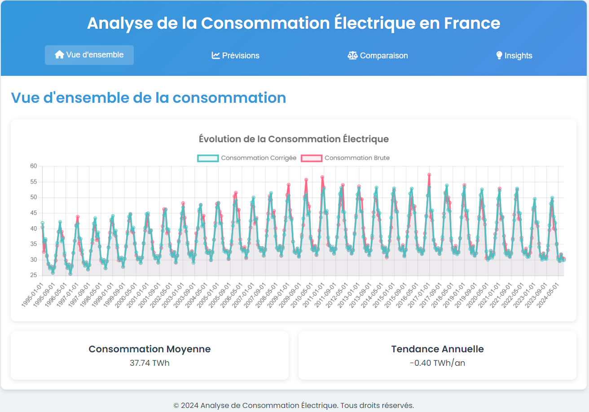

# Analyse de la Consommation Électrique en France

## Description du Projet

Ce projet vise à analyser et visualiser les données de consommation électrique en France. Il utilise les données fournies par RTE (Réseau de Transport d'Électricité) pour créer des visualisations et des prévisions de consommation électrique.

## Démonstration



[Voir la démonstration en direct](https://consommation-electrique-app-946681472540.europe-west9.run.app)

## Accès aux Données

### API RTE

Les données sont obtenues via l'API de RTE. Pour accéder à ces données :

1. Créez un compte sur le [portail API de RTE](https://data.rte-france.com/).
2. Obtenez vos clés d'API dans la section "Mes applications".
3. Utilisez ces clés dans le script `load_energy_data_to_aws.py` pour récupérer les données.

## Configuration AWS

### Configuration IAM

1. Connectez-vous à la console AWS.
2. Allez dans IAM et créez un nouvel utilisateur avec les permissions `AmazonS3FullAccess`.
3. Notez l'Access Key ID et le Secret Access Key.

### Configuration S3 Bucket

1. Dans la console AWS, allez dans S3 et créez un nouveau bucket.
2. Notez le nom du bucket.

### Stockage des Données

Utilisez le script `load_energy_data_to_aws.py` pour charger les données dans S3 :

```python
python load_energy_data_to_aws.py
```

Assurez-vous de configurer les variables d'environnement AWS_ACCESS_KEY_ID et AWS_SECRET_ACCESS_KEY avant d'exécuter le script.

## Configuration Docker

1. Installez Docker sur votre machine.
2. Construisez l'image Docker :

```bash
docker build -t consommation-electrique-app .
```

3. Exécutez le conteneur localement :

```bash
docker run -p 7000:7000 consommation-electrique-app
```

## Déploiement sur GCP

1. Installez et configurez le SDK Google Cloud.

2. Activez les API nécessaires :

```bash
gcloud services enable containerregistry.googleapis.com
gcloud services enable containeranalysis.googleapis.com
```

3. Configurez Docker pour utiliser l'authentification GCP :

```bash
gcloud auth configure-docker
```

4. Taguez l'image pour Google Container Registry :

```bash
docker tag consommation-electrique-app gcr.io/sytem-recommder/consommation-electrique-app:v1
```

5. Poussez l'image vers GCR :

```bash
docker push gcr.io/sytem-recommder/consommation-electrique-app:v1
```

6. Déployez l'application sur Cloud Run ou GKE selon vos besoins.

## Structure du Projet

- `app.py` / `main.py`: Point d'entrée de l'application Flask.
- `Dockerfile`: Configuration pour la conteneurisation de l'application.
- `requirements.txt`: Dépendances Python du projet.
- `load_energy_data_to_aws.py`: Script pour charger les données dans AWS S3.
- `static/`: Contient les fichiers CSS et JavaScript.
- `visualisations/`: Contient les images générées pour les visualisations.
- `test_main.py`: Tests unitaires pour l'application.

## Exécution Locale

1. Installez les dépendances : `pip install -r requirements.txt`
2. Exécutez l'application : `python main.py`
3. Accédez à l'application dans votre navigateur à `http://localhost:7000`

## Tests

Exécutez les tests avec la commande : `pytest test_main.py`ou make test

## Run App 

Exécutez la commende make all

---
